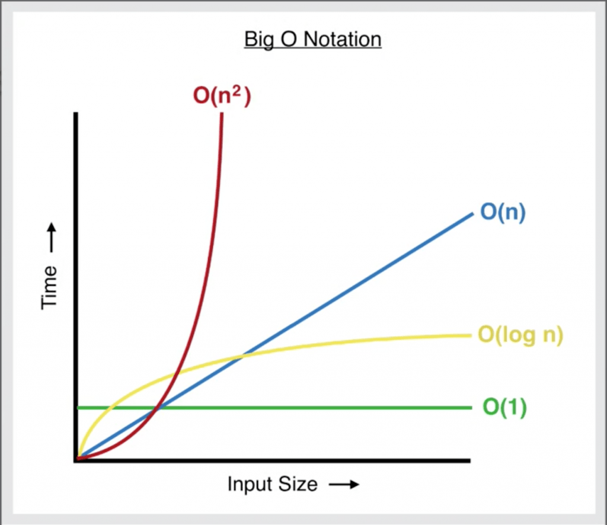
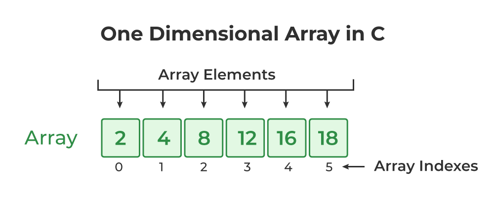
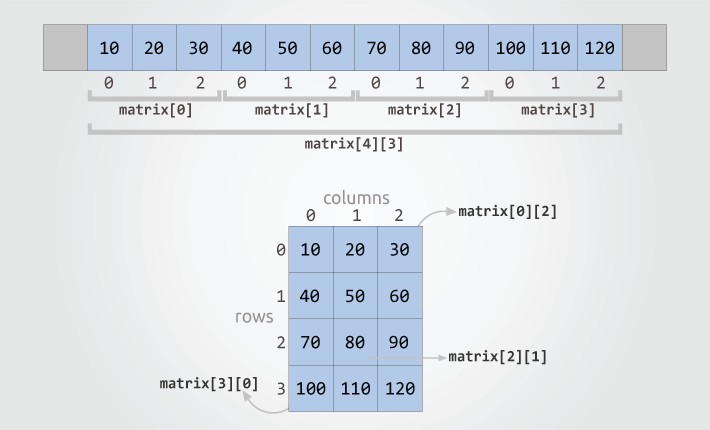
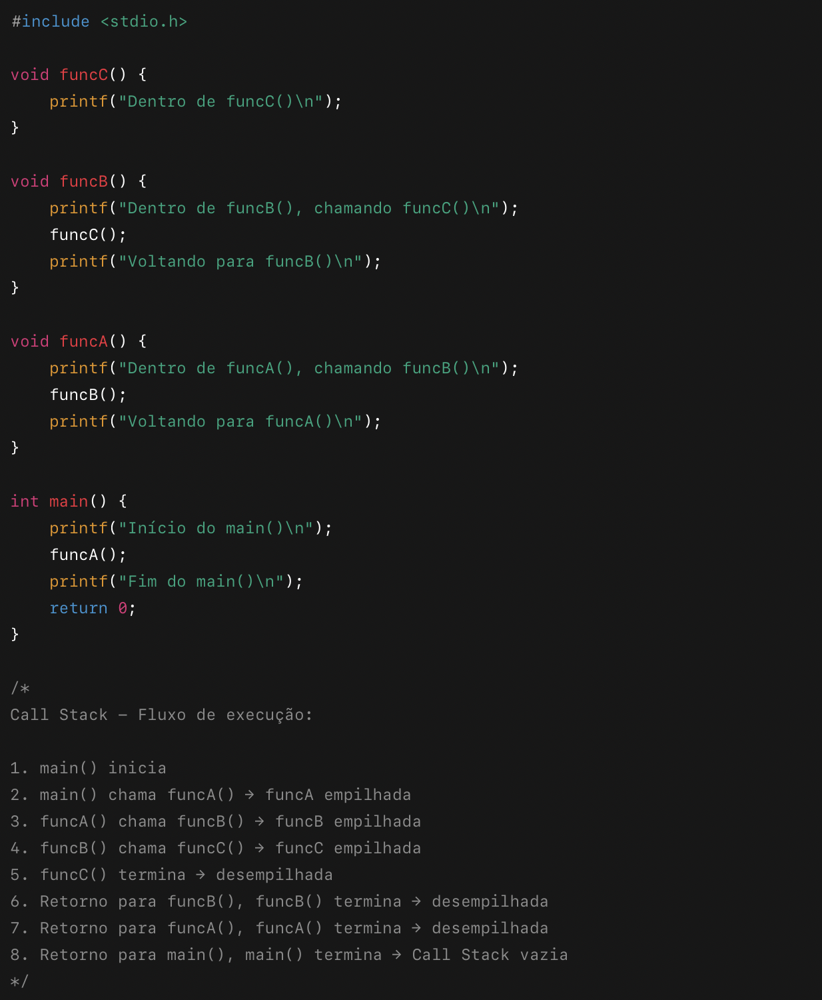

# Data Structures in C

O **data-structures-c** é um projeto acadêmico criado para praticar e entender, na prática, as estruturas de dados e algoritmos básicos da Ciência da Computação usando a linguagem C.

A ideia do repositório é servir como um material de apoio aos estudos, com implementações simples, organizadas e fáceis de acompanhar.

Cada estrutura pode ser testada diretamente pelo terminal, ajudando a visualizar como ela funciona e como os algoritmos se comportam durante a execução.

Este projeto faz parte do meu aprendizado e estudos da graduação de Ciência da Computação, e está em constante evolução conforme novos conceitos são estudados.

Sugestões e melhorias são bem-vindas.

---
# Principais Complexidade de Algoritmo
Antes de apresentar as estruturas de dados e os algoritmos presentes neste repositório, segue um resumo introdutório sobre análise de complexidade de algoritmos, utilizando a notação $Big-O$.

A notação $Big-O$ é usada para descrever como o tempo de execução de um algoritmo cresce conforme o aumento da quantidade de dados de entrada.

Abaixo estão algumas das **principais** complexidades mais utilizadas no dia a dia, acompanhadas de um exemplo gráfico para facilitar a visualização e comparação entre elas.

## Modelo Gráfico Notação $Big(O)$



---
## Complexidade $O(1)$
A complexidade $O(1)$, também chamada de complexidade constante, é a mais rápida de todas. No gráfico é possível observar que ela aparece como uma linha reta, pois o tempo de execução não varia conforme a quantidade de dados.

Isso significa que o algoritmo sempre executa em tempo constante, independentemente do tamanho da entrada.

Um exemplo clássico de $O(1)$ é o acesso a um elemento de um array por índice. Não importa se o array possui $10$, $100$ ou $1.000.000$ de elementos: acessar $array[5]$ sempre leva o mesmo tempo, pois o índice aponta diretamente para a posição desejada na memória.

---
## Complexidade $O(Log n)$
A complexidade $O(log N)$ possui um crescimento logarítmico, o que significa que o tempo de execução aumenta conforme os dados crescem, porém a uma taxa muito menor quando comparada ao crescimento da quantidade de dados.

Um exemplo clássico desse comportamento ocorre em algoritmos como a **busca binária**, onde a cada iteração o problema é reduzido pela metade.

### Exemplo prático
Suponha que, para cada iteração do laço, o programa leve 1 milésimo de segundo para executar
(obviamente, esse valor é apenas uma suposição):

#### Caso 1 — 100 elementos
```
log₂ 100 ≈ 6,64 ≈ 7 passos
7 passos × 1 ms ≈ 7 ms
```
#### Caso 2 — 1.000.000.000 de elementos

```
log₂ 1.000.000.000 ≈ 29,9 ≈ 30 passos
30 passos × 1 ms = 29,9 ms (≈ 30 ms)
```
---
### Comparação do crescimento

**Quantidade de dados**
```
100 → 1.000.000.000  (crescimento de 10.000.000×)
```

**Tempo de execução**
```
7 ms → 29,9 ms       (crescimento de ~4,27×)
```
---

### Conclusão
Mesmo com um aumento extremamente grande na quantidade de dados, o tempo de execução cresce muito pouco.
Esse comportamento demonstra claramente a eficiência de algoritmos com complexidade $O(log N)$, tornando-os ideais para trabalhar com grandes volumes de dados.

---
## Complexidade $O(n)$
A complexidade $O(n)$ possui um crescimento linear, o que significa que o tempo de execução cresce proporcionalmente à quantidade de dados de entrada.

Em outras palavras, se a quantidade de dados dobra, o tempo de execução também dobra. 

Esse comportamento é comum em algoritmos que precisam percorrer todos os elementos, como buscas lineares ou laços simples que analisam cada item uma única vez.

### Exemplo prático
Suponha que, para processar cada dado, o programa leve 1 milésimo de segundo (1 ms) para executar (novamente, esse valor é apenas uma suposição).
#### Caso 1 — 100 dados

```
N ≈ 100
100 operações × 1 ms ≈ 100 ms
```
#### Caso 2 — 1.000.000.000 dados
```
N ≈ 1.000.000.000
1.000.000.000 operações × 1 ms ≈ 1.000.000.000 ms (11,57 Dias)
```
---
### Conclusão
Diferente da complexidade $O(log N)$, em $O(N)$ o tempo de execução cresce na mesma proporção que a quantidade de dados. Por isso, algoritmos lineares podem se tornar lentos quando aplicados a volumes muito grandes de informação.

---
## Complexidade $O(n²)$
A complexidade $O(n²)$ possui um crescimento quadrático, o que significa que o tempo de execução cresce de forma muito mais acelerada à medida que a quantidade de dados aumenta.

Isso ocorre porque, para cada elemento, o algoritmo precisa percorrer novamente todos os demais elementos.

Esse comportamento é comum em algoritmos que utilizam dois laços aninhados, como alguns algoritmos de ordenação simples (ex.: bubble sort, selection sort).
### Exemplo prático
Suponha que, para cada operação, o programa leve 1 milésimo de segundo (1 ms) para executar
(novamente, esse valor é apenas uma suposição).
#### Caso 1 — 100 dados
```
N ≈ 100
N² ≈ 100² ≈ 10.000 operações

Tempo Real: 10.000 operações × 1 ms = 10.000 ms
10.000 ms = 10 s
```
#### Caso 2 — 1.000.000.000 dados
```
N = 1.000.000.000
N² = (1.000.000.000)² = 10¹⁸ operações

Tempo Real: 10¹⁸ operações × 1 ms = 10¹⁸ ms

Conversão de Tempo: 10¹⁸ ms = 10¹⁵ s 
10¹⁵ s ≈ 31.709.791 anos
```
---
### Conclusão
Algoritmos com complexidade $O(N²)$ se tornam rapidamente inviáveis para grandes volumes de dados. Mesmo um crescimento moderado na entrada causa um aumento explosivo no tempo de execução, o que torna esse tipo de algoritmo adequado apenas para conjuntos pequenos de dados.

---
# Principais Estruturas de Dados
De forma resumida, estruturas de dados são maneiras de armazenar, organizar e manipular informações em um computador de forma eficiente, permitindo que algoritmos e sistemas funcionem com melhor desempenho.

É comum que iniciantes em Ciência da Computação, especialmente aqueles focados apenas em programação, não deem muita atenção a algoritmos e estruturas de dados. Durante o aprendizado inicial, geralmente lidamos com quantidades pequenas de dados, então a eficiência no tratamento dos dados não parece tão importante.

No entanto, ao trabalhar com grandes volumes de dados, é essencial que um programador saiba armazenar e manipular informações de forma eficiente, garantindo que o algoritmo seja rápido e faça uso adequado do hardware.

Para avaliar e comparar essa eficiência, utiliza-se a notação Big-O, apresentada no capítulo anterior.

Algumas das principais estruturas de dados são: 
* Arrays
* Listas encadeadas (Linked List)
* Pilhas (Stacks)
* Filas (Queues)
* Árvores (Trees)
* Tabelas Hash (Hash Tables)
* Grafos (Graphs)

## Arrays
Arrays são estruturas de dados que armazenam uma coleção de elementos do mesmo tipo em posições contíguas de memória. Eles possuem tamanho fixo, definido no momento da criação, e permitem acesso rápido a cada elemento através de índices numéricos.

### Vetores (Arrays unidimensionais)
Vetores são arrays que organizam os elementos em uma sequência linear. Cada elemento é identificado por um índice único, que começa em 0 e vai até o tamanho do vetor menos 1 $(n-1)$.

No exemplo abaixo, temos um vetor com 6 posições, cujos índices vão de 0 a 5:
Exemplo: 
```
int vetor[6] = {2, 4, 8, 12, 16, 18}; → vetor[2] retorna 8.
```

### Matrizes (Arrays multidimensionais):

Matrizes são arrays que possuem duas ou mais dimensões, permitindo organizar os dados em linhas e colunas. Cada elemento é acessado usando múltiplos índices, que também começam em 0.

No exemplo abaixo, temos uma matriz com 4 linhas e 3 colunas, cujas posições variam de 0, 0 a 3, 2:
Exemplo: 
```
int matriz[4][3] = {{10,20,30}, {40,50,60}, {70,80,90}, {100,110,120}}; → matriz[1][2] retorna 60.
```


### Resumo: 
Arrays permitem acesso rápido e organização sequencial, sendo fundamentais para diversas operações em algoritmos.

---
## Lista Encadeada (Linked List)
Listas encadeadas são estruturas de dados formadas por nós, onde cada nó contém um valor e um ponteiro para o próximo nó da lista. Diferentemente dos arrays, elas permitem a inserção e a remoção de elementos de forma dinâmica, sem a necessidade de realocar toda a estrutura. Para remover ou inserir um elemento, basta atualizar os ponteiros dos nós adjacentes, ligando-os ao próximo ou anterior nó, como se você cortasse um elo de uma corrente e depois conectasse os elos restantes novamente. Além disso, listas encadeadas não possuem tamanho fixo, o que facilita o desenvolvimento de algoritmos em que a quantidade de elementos varia e não é possível determinar previamente o tamanho.

Apesar da rapidez em inserções e remoções, o acesso aos elementos de uma lista encadeada é mais lento. Como os nós não estão armazenados em posições contíguas de memória, não é possível acessar um elemento diretamente por índice, como em um array. Para chegar a um elemento específico, é necessário percorrer a lista desde o início, seguindo os ponteiros de cada nó até encontrar o desejado. Dessa forma, listas encadeadas oferecem grande flexibilidade para modificações, mas o acesso direto a elementos é menos eficiente.


### Resumo:
Listas encadeadas são ideais para situações em que o número de elementos varia constantemente, pois permitem inserções e remoções de forma eficiente. No entanto, acessar um elemento específico exige percorrer a lista desde o início até o nó desejado, tornando o acesso mais lento que em arrays.

---
## Pilha (Stack)
Pilhas são estruturas de dados que armazenam elementos seguindo o princípio **LIFO (Last In, First Out)**, ou seja, o último elemento a entrar é o primeiro a sair. Elas são muito utilizadas em sistemas que precisam registrar ações para que possam ser desfeitas, como no comando CTRL + Z. Nesse caso, cada nova ação é armazenada “por cima” da anterior, de forma que o elemento inserido primeiro fique na base da pilha e o mais recente fique no topo. Quando é necessário desfazer uma ação, o sistema remove primeiro o elemento do topo, que foi o último a ser inserido.

Outro exemplo de aplicação das pilhas é a call stack (pilha de chamadas), usada para controlar a execução de funções em programas. Funções ou métodos são blocos de código que executam tarefas específicas e podem retornar um valor. A call stack organiza essas chamadas de modo que a função mais recentemente chamada seja concluída primeiro antes das anteriores, seguindo o mesmo princípio **LIFO** da pilha.



Quando uma função chama outra, cada chamada é armazenada na pilha de chamadas. Por exemplo, o método main() é o primeiro a ser colocado na pilha. Em seguida, se ele chama a função funcA(), esta é adicionada por cima do main(). Se funcA() chama funcB(), funcB() é adicionada no topo, e se funcB() chama funcC(), funcC() vai para o topo da pilha.

Como funcC() não chama nenhuma outra função, ela é executada completamente primeiro. Depois que funcC() termina, o controle retorna para funcB(), que continua sua execução, seguida por funcA(). Por fim, o main() retoma e conclui sua execução. Esse comportamento segue exatamente o princípio **LIFO (Last In, First Out)**, característico das pilhas.

A pilha possui algumas operações básicas que permitem sua implementação e manipulação. Entre elas:
* Push: adiciona um elemento no topo da pilha.
* Pop: remove o elemento que está no topo da pilha.
* Peek/Top: consulta qual é o elemento do topo, sem removê-lo.
* isEmpty: verifica se a pilha está vazia.


### Resumo: 
Pilhas são estruturas de dados que armazenam elementos seguindo o princípio **LIFO (Last In, First Out)**, ou seja, o último elemento inserido é o primeiro a ser removido. Elas permitem adicionar elementos ao topo da pilha, remover elementos do topo e consultar o elemento do topo sem removê-lo. Pilhas podem ser implementadas tanto com arrays, que possuem tamanho fixo, quanto com listas encadeadas, que permitem crescimento dinâmico conforme necessário.

Essa estrutura é especialmente útil em situações como reversão de dados, avaliação de expressões matemáticas e controle de histórico de ações, como em navegadores. Embora não seja possível acessar diretamente elementos específicos sem percorrer a pilha, as operações principais de inserção e remoção no topo são extremamente rápidas, com complexidade $O(1)$.

---